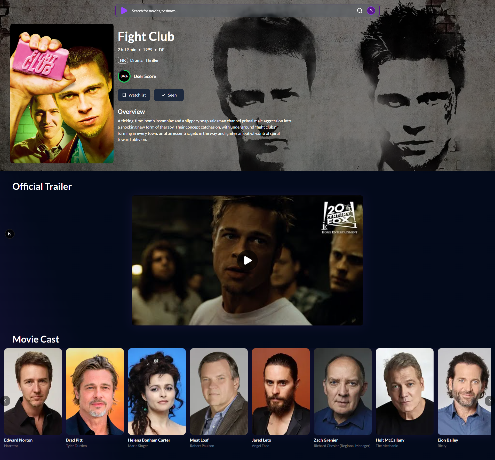
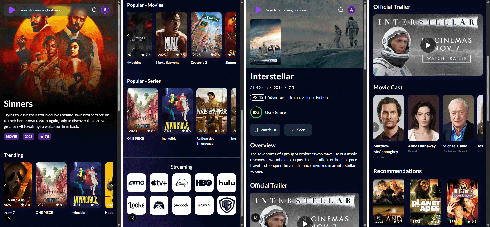
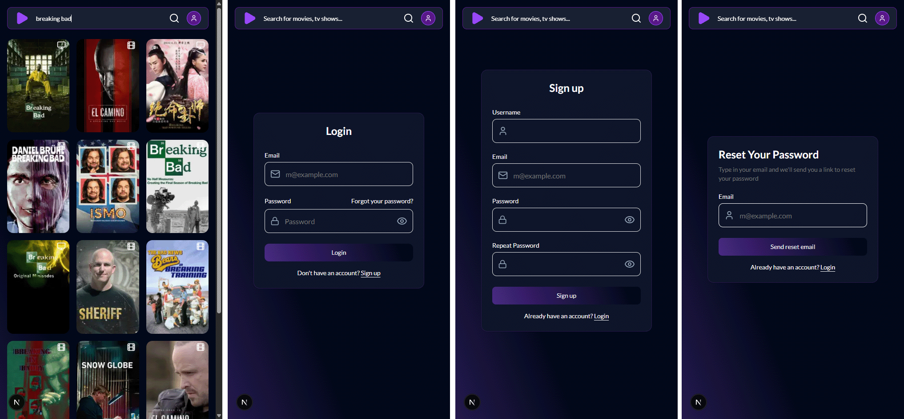
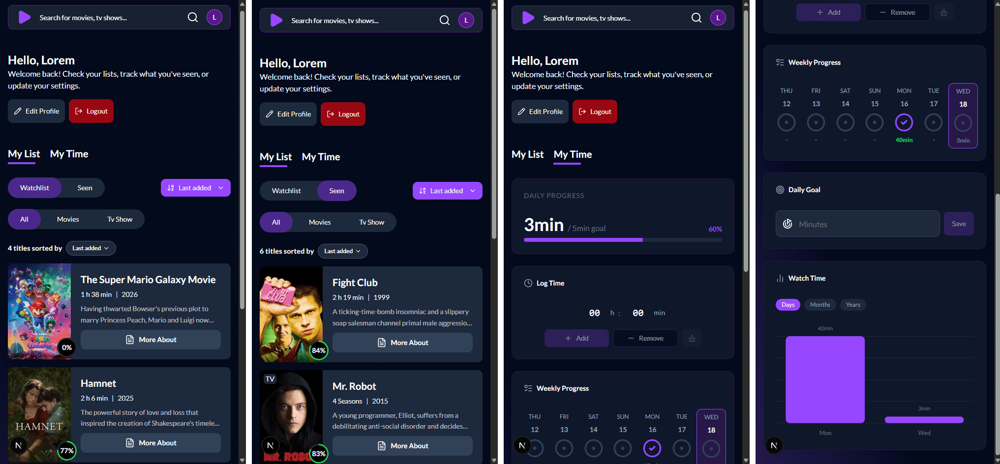

# Movie Search 🎬🔍

<h3 align="center">Status: 🟢 Active</h3>

<p align="center">
  
  
  
  
</p>

## Table of Contents

- [Description](#description)
- [Screenshot](#screenshot)
- [Live Demo](#live-demo)
- [Project Structure](#project-structure)
- [Key features](#key-features)
- [Routes](#routes)
- [Tech stack](#tech-stack)
- [Requirements](#requirements)
- [Running locally](#running-locally)
- [Full documentation](#full-documentation)

## Description

Movie Search is an application that consumes the **TMDB API**. It lists **movies and TV shows**, lets you view **details** about them (including **cast**), and allows you to **save titles to watch later** (watchlist/seen). It also lets you log **how much time you watched each day**, so you can track how many minutes/hours you consumed per **day / month / year**.

## Live Demo

👉 [View the project online](https://movie-search-dev.netlify.app/)

## Screenshot

<!-- Add your screenshot below -->
<p align="center">
  
</p>

<p align="center">
  
</p>

<p align="center">
  
</p>

<p align="center">
  
</p>

## Project Structure

```
.
├── db/                   # Database-related assets
│   └── schemas/          # Supabase SQL 
├── public/               # Static assets
├── src/                  # Source code
│   ├── app/              # Next.js App Router 
│   ├── actions/          # Server Actions (Supabase + business logic)
│   ├── components/       # Reusable React components 
│   ├── context/          # Client contexts (auth, media status)
│   ├── lib/              # Utilities & configurations (TMDB, Supabase, auth helpers)
│   ├── types/            # Shared TypeScript types
│   └── utils/            # Utility functions
├── .env.example          # Environment variables example
├── DOCUMENTATION.md      # Full site documentation
├── README.md
└── ...
```

## Key features

- **Home feed**: trending and popular sections for movies and TV shows.
- **Search**: paginated TMDB search (movies and TV only).
- **Details page**:
  - Overview and metadata
  - **Cast**
  - Recommendations
  - Official trailer (when available)
- **User library**:
  - Toggle **Watchlist** and **Seen**
  - Stored in Supabase (`user_media`)
  - Uses the RPC function `toggle_media_status`
  - **API route**: `GET /api/user/library` returns `{ seen, watchlist }`
  - Sort preference stored in `user_preferences`
- **Watch-time tracking**:
  - Set a daily goal (minutes)
  - Add/remove time watched for the day
  - Weekly progress and charts for **days / months / years**
- **Authentication (Supabase Auth)**:
  - Sign up / sign in
  - Forgot password / update password
  - Protected areas: `/profile/*` and `/api/*`
- **Profile**:
  - Update username (`profiles`)
  - Delete account (requires `SUPABASE_SERVICE_ROLE_KEY`)

## Routes

- **Public**
  - `/` (home)
  - `/:type/:id` (details; `type` is `movie` or `tv`)
  - `/auth/login`
  - `/auth/signup`
  - `/auth/forgot-password`
  - `/auth/update-password`
- **Protected**
  - `/profile`
  - `/profile/edit`
- **API**
  - `GET /api/user/library`

## Tech stack

- **Next.js 16 / React 19**
- **Supabase** (`@supabase/ssr`, `@supabase/supabase-js`)
- **TanStack React Query**
- **Tailwind CSS + shadcn/ui**
- **Zod** (validation)
- **Recharts** (charts) and **Swiper** (carousel)

## Requirements

- Node.js (recommended: LTS)
- A TMDB account (access token)
- A Supabase project

## Running locally

1) Install dependencies:

```bash
npm install
```

2) Create `.env.local` from `.env.example`:

```bash
cp .env.example .env.local
```

3) Fill in `.env.local`:

- `NEXT_PUBLIC_SUPABASE_URL`
- `NEXT_PUBLIC_SUPABASE_PUBLISHABLE_KEY`
- `SUPABASE_SERVICE_ROLE_KEY` (required for **account deletion**)
- `TMDB_API_URL` (already set in the example)
- `TMDB_ACCESS_TOKEN`

4) Create the database schema on Supabase (SQL)

Run the scripts inside `db/schemas/` **in order**:

- `db/schemas/001_create_tables.sql`
- `db/schemas/002_create_policies.sql`
- `db/schemas/003_create_triggers.sql`
- `db/schemas/004_create_functions.sql`

You can paste each file into Supabase **SQL Editor** and run them one by one.

5) Start the app:

```bash
npm run dev
```

Open `http://localhost:3000`.

## Full documentation

See `DOCUMENTATION.md` for the detailed setup (Supabase + TMDB), database tables/policies, routes, and feature behavior.

---

<h3 align="center">This project was made with ❤️ by Pedro Silva</h3>

